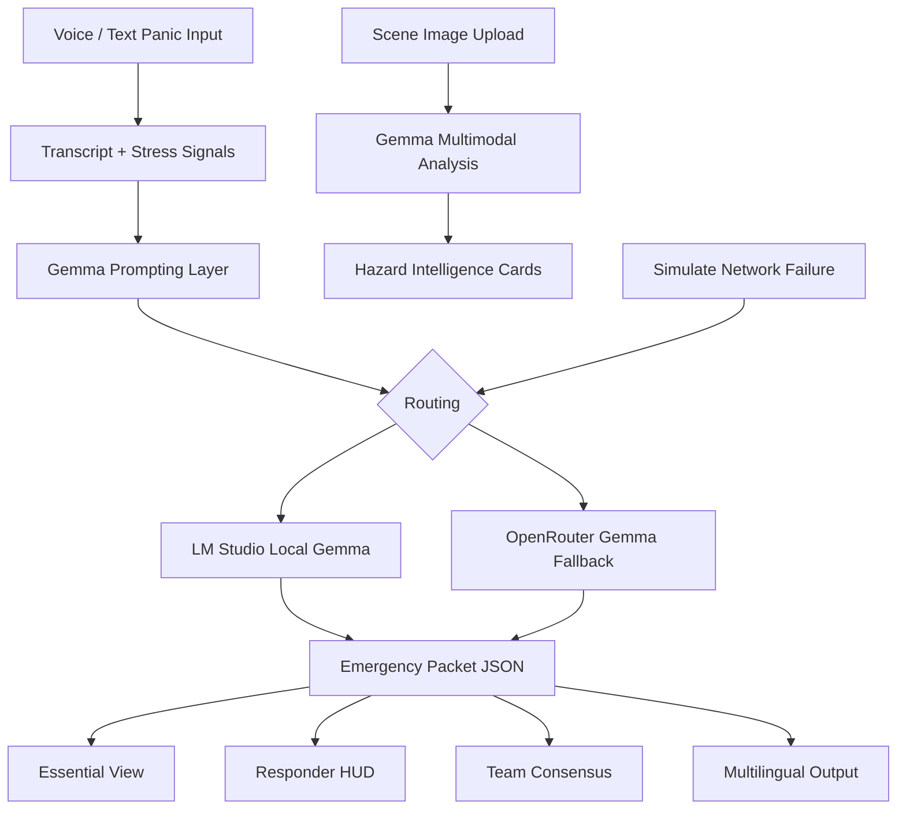
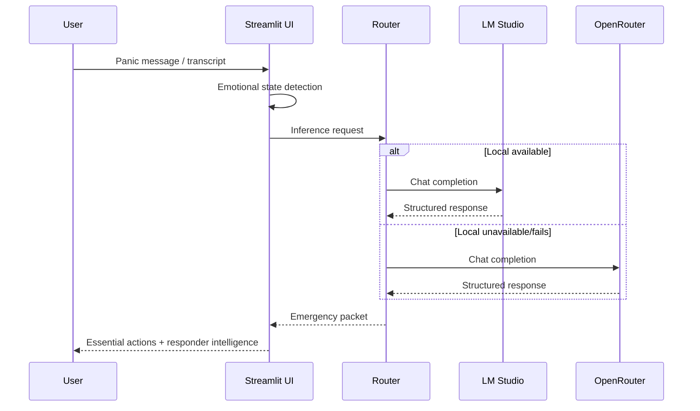

# Last Message

AI-powered emergency communication when panic takes over.

When words fail, AI helps humans be heard.

Last Message is a Streamlit-based emergency intelligence app built for the Gemma 4 Good Hackathon. It transforms chaotic panic input into concise, actionable rescue communication for civilians, families, and responders.

#### Video Pitch: [https://youtu.be/1Tq16hbdz48](https://youtu.be/1Tq16hbdz48)

#### Screenshots


## Why this project exists
In real emergencies, people do not communicate in perfect sentences. They speak in fragments, fear, and urgency. Last Message focuses on cognitive clarity under stress:

- panic speech or text in
- calm structured rescue output out
- local-first inference for resilience
- scannable emergency UI for decision-making under pressure

## Core capabilities
- PANIC MODE with voice capture and fallback dictation path
- Emotional state detection (stress, panic severity, clarity)
- Adaptive response style (shorter, calmer instructions under high panic)
- Structured emergency packet generation
- Family-safe SMS output
- Low-connectivity compressed packet
- Multimodal scene analysis from uploaded disaster images
- Network failure simulation with local failover narrative
- Multi-agent emergency consensus (Medic, Structural, Rescue)
- Responder HUD view with tactical mini-metrics
- Multilingual emergency mode (Hindi, Telugu, Spanish, Arabic)

## Tech stack
- Python 3.11+
- Streamlit
- LM Studio (OpenAI-compatible local endpoint)
- OpenRouter (fallback cloud inference)
- Browser SpeechRecognition API
- HTML/CSS/JS embedded in Streamlit components
- Requests + dotenv

## Architecture


## Request lifecycle


## Repository structure
```text
.
├── app.py
├── requirements.txt
├── README.md
├── assets/
├── components/
│   ├── __init__.py
│   ├── ui.py
│   └── voice.py
├── prompts/
│   └── emergency_packet_prompt.txt
└── utils/
    ├── __init__.py
    ├── config.py
    ├── inference.py
    ├── parser.py
    └── prompting.py
```

## Setup
### 1) Clone
```bash
git clone https://github.com/harishkotra/last-message.git
cd last-message
```

### 2) Install
```bash
python -m venv .venv
source .venv/bin/activate
pip install -r requirements.txt
```

### 3) Configure environment
```bash
cp .env.example .env
```

Set values in `.env`:
```env
LM_STUDIO_ENDPOINT=http://localhost:1234/v1/chat/completions
LM_STUDIO_MODEL=google/gemma-4-e4b
OPENROUTER_ENDPOINT=https://openrouter.ai/api/v1/chat/completions
OPENROUTER_MODEL=google/gemma-3-12b-it:free
OPENROUTER_API_KEY=your_key_here
```

### 4) Run app
```bash
streamlit run app.py
```

## LM Studio quick setup
1. Install LM Studio.
2. Download a Gemma model compatible with your hardware.
3. Start local server mode.
4. Confirm endpoint is reachable at `http://localhost:1234/v1/chat/completions`.

## Key implementation snippets
### Local-first with cloud fallback
```python
def run_text_inference(system_prompt: str, user_prompt: str, cfg: ModelConfig) -> str:
    primary, cloud_available = provider_state(cfg)
    if primary is None:
        raise InferenceError("No model provider configured in .env")

    try:
        if primary == "local":
            return run_lm_studio_inference(system_prompt, user_prompt, cfg)
        return run_openrouter_inference(system_prompt, user_prompt, cfg)
    except InferenceError:
        if primary == "local" and cloud_available and not st.session_state.network_failure_mode:
            return run_openrouter_inference(system_prompt, user_prompt, cfg)
        raise
```

### Stress-aware response adaptation
```python
state = emotional_state(st.session_state.panic_input)
style_line = (
    "Use very short step-by-step instructions and calming language."
    if state["response_style"] == "short"
    else "Use concise but complete instructions with calm tone."
)
system_prompt = load_emergency_system_prompt() + "\nAdaptive response mode: " + style_line
```

### Multimodal scene intelligence
```python
raw = run_image_inference(system_prompt, user_prompt, image_data_url, cfg)
st.session_state.scene_analysis = safe_json(raw, fallback)
```

## Contributing
Contributions are welcome and encouraged.

### Fork and contribute
1. Fork this repository.
2. Create a feature branch.
3. Make focused changes with tests/manual validation notes.
4. Open a pull request with screenshots for UI changes.

### Suggested contribution standards
- Keep emergency UX cognitively lightweight.
- Prefer short actionable output over verbose prose.
- Preserve local-first routing behavior.
- Avoid heavy infra additions.

### Good first features to add
- Automatic TTS playback of emergency steps
- Incident-type templates (flood/fire/collapse)
- Better geolocation fallback when permission denied
- Export packet as SMS-ready one-tap copy block
- Accessibility mode (large-font, extra contrast, dyslexia-friendly spacing)
- Structured incident timeline for responders

## Testing checklist
- Voice capture starts and stops without state conflicts
- Manual voice fallback path works
- Demo mode always produces packet (even if live inference fails)
- Local inference works with LM Studio
- Cloud fallback works when local fails
- Network failure simulation forces local routing
- Scene analysis returns compact hazard chunks

## Safety note
This is a hackathon prototype and not a certified dispatch/medical system. In real emergencies, contact official emergency services immediately.
